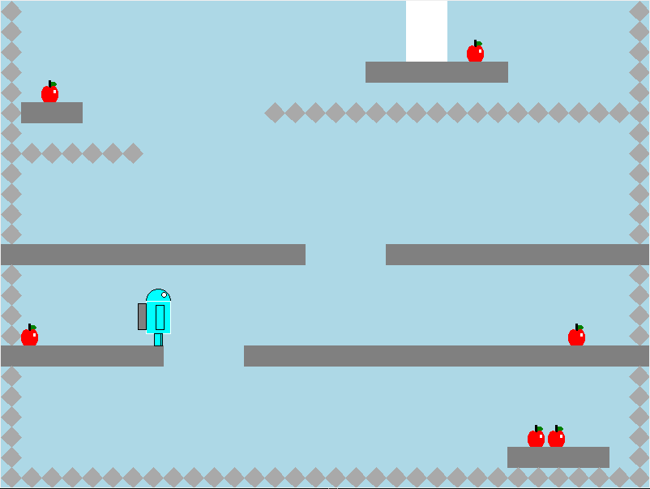

# Apple Chaser

This game was initially created for a programming competition in which I was not allowed to use classes or non-standard libraries. Maintaining the same rules I will improve it to a finished version.

The version submitted to the competition can be found here.
https://www.github.com/KevinDNF/gameCompetition/tree/v1.0

## Goal

+ Eat as many apples as you can before entering the gate (white rectangular block).
+ Avoid hitting the mines or the android will explode.
+ Complete 3 levels to win the game.

## Controls

+ "a" or "left-arrow" - Moves android left
+ "d" or "right-arrow" - Moves android right
+ "space" - Toggles the Jetpack on or off

## To-Do

+ Clean current code
+ Add enemies
+ Add a GUI
+ Improve graphics 
+ Add cute hats and more character customization 
+ Create a level creator

